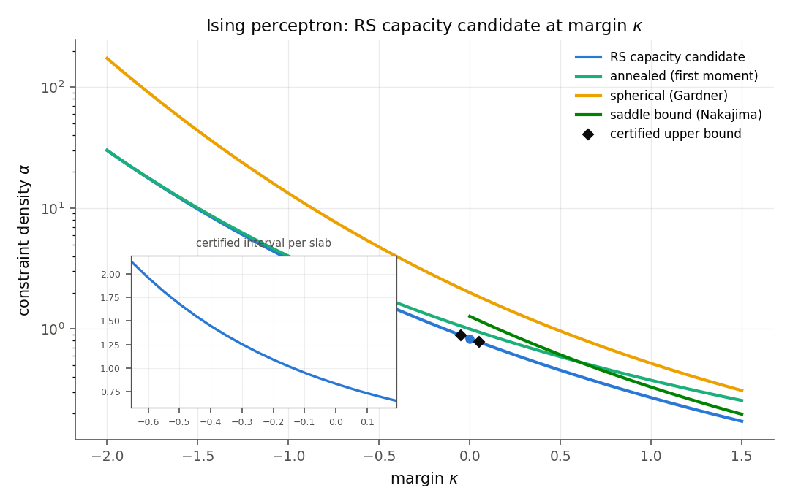
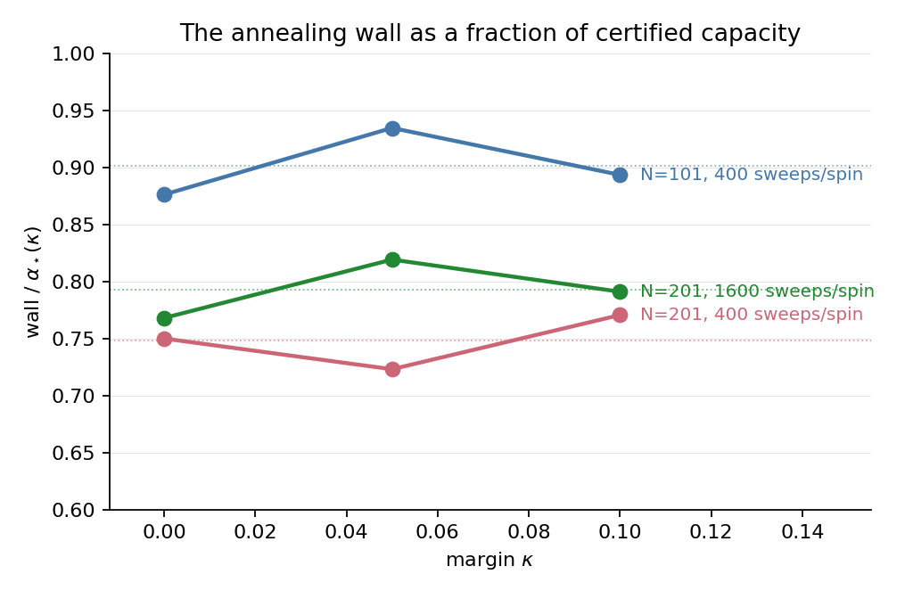

# The Ising perceptron at nonzero margin

Verification code, certificates, and paper for the margin extension of
the Ising perceptron capacity results: the replica-symmetric predicted
capacity alpha_*(kappa) of the binary-weight perceptron with
constraints <g_a, w>/sqrt(N) >= kappa.  What is certified here are
unconditional upper bounds at five margins; the matching lower bound
is proved (by Ding-Sun) only at kappa = 0, so these are not exact
thresholds at nonzero margin (see the "Toward the matching lower
bound" section of the paper).

Huang's general-margin capacity upper bound is conditional on four
numerical hypotheses per margin.  This repository certifies all four
in ball arithmetic (python-flint/Arb) at five margins, so the
capacity upper bound is unconditional at each:

| kappa   | alpha_*(kappa), certified enclosure |
|---------|-------------------------------------|
| -0.45   | [1.557652103, 1.557654133]          |
| -0.05   | [0.889408031, 0.889409783]          |
|  0.05   | [0.781073068, 0.781074776]          |
|  0.0995 | [0.733478513, 0.733480205]          |
|  0.13   | [0.705932217, 0.705933898]          |

Behind the five unconditional points: the fixed-point, AMP, and
local-concavity hypotheses are certified on the whole strip kappa in
[-0.65, 0.19] (1680 contiguous slabs, two independent uniqueness
lanes), the Hessian of the first-moment functional is certified at
its degenerate maximizer, and the remaining hypothesis (the global
two-variable bound) is certified per margin by a four-piece
architecture: a bounded moment-plane sweep, a star of anchored
Bregman certificates around the degenerate maximizer, a second-stage
union-containment sweep over the exclusion region, and an
exact-rational star-interior certificate.  At kappa = 0 every
pipeline reproduces the certified zero-margin values.

The paper (`paper/main.tex`, `main.pdf`) develops the theory,
documents the verification, and reads the curve quantitatively for
machine learning: the price of demanded robustness (capacity halves
per 0.50 of margin), the margin distribution among solutions and the
free slack it implies, per-bit storage economics of binary versus
ternary weights, and finite-size experiments locating the annealing
wall against the certified ceiling.  In those experiments the wall
sits at a kappa-independent fraction of alpha_*(kappa) within each
size and budget:

## Layout

- `paper/` --- the manuscript.
- `verification/` --- all code, exactly as run.  `core.py` is vendored
  from the zero-margin verification
  (github.com/yspennstate/ising-perceptron-capacity) so the clone is
  self-contained.
- `verification/results/` --- the certificates: slab tables
  (`certified_intervals*.csv`), the two-variable manifests for the
  five margins (`huang_*_<tag>.json` with tags `0p05`, `n0p05`,
  `0p0995`, `0p13`, `n0p45`), deep alpha_* intervals, worker evidence
  under `results/box/` (including failed first attempts kept as
  evidence), the finite-size experiment tables, and figures.
- `verification/lean_skeleton/` --- the Lean 4 skeleton: an extractor
  with an exact-rational mirror, kernel-decided files per margin under
  `generated/<tag>/`, and a mutation battery that escalates through
  candidate corruptions until one is rejected.
- `verification/AUDIT.md` --- the algorithm-to-code map: for every
  certificate family, the claim, the algorithm, the code location, and
  the soundness argument.

## Replay

Requirements: Python 3.11+ with `python-flint` (and `mpmath`, `numpy`,
`scipy`, `matplotlib` for the nonrigorous layers); Lean 4 (v4.31.0)
for the skeleton.  From `verification/`:

    python selfcheck.py
    python full_battery.py            # assembler + portable checker +
                                      # Lean kernel + mutation battery,
                                      # over every extracted margin
    python portable_check.py --tag 0p13   # stdlib-only, per margin
    python assemble_2varfn.py n0p45       # the per-margin verdict

A margin certifies end to end with the pilot (here 0.13; expect hours
for Region I):

    python pilot_2varfn.py --ktag 0p13 --kappa 0.13 \
        --alpha-lo 0.705932217 --alpha-hi 0.705933898 \
        --q-lo 0.573 --q-hi 0.597 --workers 4

Enclosure digits vary with the FLINT build; the PASS/FAIL verdicts do
not.  The Lean skeleton regenerates and checks with

    cd lean_skeleton
    python extract_margin.py --results ../results --tag 0p13
    lean generated/0p13/<file>.lean     # each file is self-contained
    python mutate_margin.py --lean <path-to-lean> --tag 0p13

The float layers (`km.py`, `scan_kappa.py`, `huang2var.py`,
`scan2var.py`, `ml_numerics.py`, `finite_size_experiment.py`,
`exploration/ternary_km.py`) are diagnostics, not certificates, and
are labeled as such throughout.
